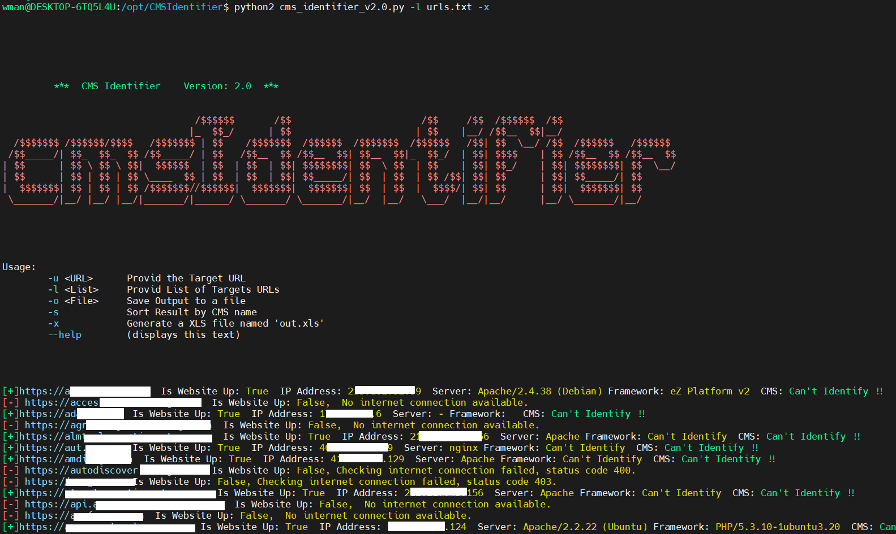
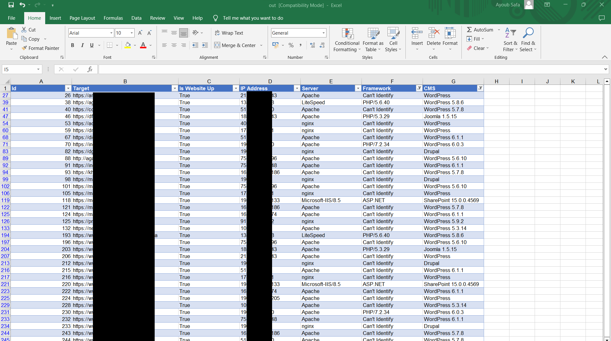

# CMSIdentifier

# Introduction
This tool is designed to identify the full stack of a given URL or a list of URLs. It includes information about the type of CMS used, the technology, IP address, and the server status (whether it is up or down). The purpose of this tool is to identify any vulnerable versions of products used by clients and to fix vulnerabilities before they can be exploited.

# Background
This tool was developed in response to a manual process that was time-consuming and repetitive. The manual process consisted of manually researching different techniques for identifying CMS and technologies, either from the source code of a web application or by accessing and parsing specific files. I decided to automate this process by creating a script that would automate the task and speed up the process.

# Functionality
Before developing this tool, the developer researched different techniques for identifying CMS and technologies and implemented these techniques in the form of different functions and logic in the tool. The tool works by accessing and parsing specific files and by analyzing the source code of web applications. The information gathered by the tool is then used to identify the full stack of a given URL or a list of URLs, including information about the type of CMS, technology, IP address, and server status.

# Technical Details
Please note that this tool is based on Python2 and is considered to be an older tool. As such, it may not be compatible with newer systems and technologies. If you are planning on using this tool, it is recommended that you ensure that your system meets the necessary requirements and that you have a basic understanding of Python programming.

# Conclusion
In conclusion, this tool provides a quick and easy way to identify the full stack of a given URL or a list of URLs, including information about the type of CMS, technology, IP address, and server status. This information can be used to identify vulnerable versions of products and to fix vulnerabilities before they can be exploited. If you are interested in using this tool, please be aware of its limitations and ensure that your system meets the necessary requirements.
